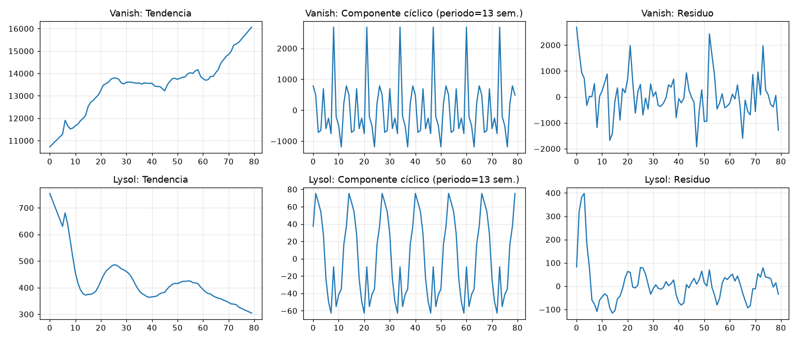
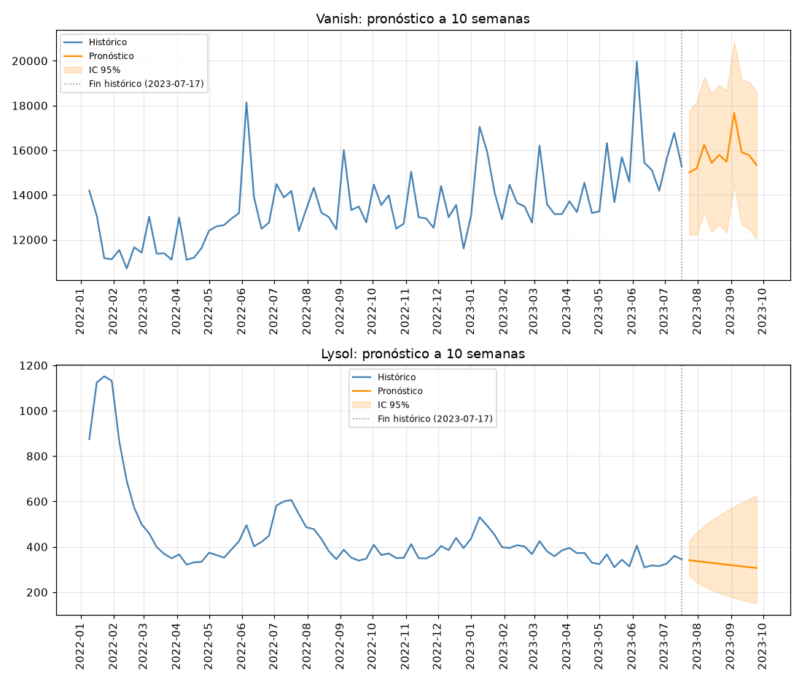

#  Sales Forecasting: ARIMA/SARIMA vs. Multiple Regression
### Pronóstico de Ventas: ARIMA/SARIMA vs. Regresión Múltiple

> **EN** · Time series forecasting project comparing Box-Jenkins (ARIMA/SARIMA) models against a multiple linear regression benchmark to predict national weekly sales for two brands, with the choice of technique justified by evidence rather than assumed by default.
> 
> **ES** · Proyecto de pronóstico de series de tiempo que compara modelos Box-Jenkins (ARIMA/SARIMA) contra un benchmark de regresión lineal múltiple para predecir ventas semanales a nivel nacional de dos marcas, con la elección de técnica justificada con evidencia, no asumida por defecto.

---

##  Overview / Descripción

**EN** · This project branches off the [ETL pipeline](https://github.com/ReginaPema/etl-sales-data-cleaning) to forecast national weekly sales value for **Vanish** and **Lysol** (two brands in the *Fabric Treatment and Sanitizers* segment), 80 weeks of history (Jan 2022 – Jul 2023). It runs its own time-series-focused EDA, compares ARIMA/SARIMA against a regression benchmark quantitatively, and produces a validated 10-week forecast for each brand.

**ES** · Este proyecto parte del [pipeline ETL](https://github.com/ReginaPema/etl-sales-data-cleaning) para pronosticar el valor de venta semanal a nivel nacional de **Vanish** y **Lysol** (dos marcas del segmento *Fabric Treatment and Sanitizers*), con 80 semanas de historia (ene 2022 – jul 2023). Corre su propio EDA enfocado en series de tiempo, compara ARIMA/SARIMA contra un benchmark de regresión de forma cuantitativa, y genera un pronóstico validado a 10 semanas para cada marca.

---

##  Modeling Highlights / Hallazgos del Modelado

**EN** ·

- **The national aggregate.** The goal is precisely a national forecast, so the `Total Nacional` row created in the ETL is used directly.
- **Model choice justified by both theory and a quantitative benchmark.** ARIMA/SARIMA was selected based on non-stationarity (ADF test) and significant autocorrelation (ACF/PACF) observed in the EDA, but the notebook doesn't stop at theory: a multiple regression benchmark is trained and compared head-to-head on the same test set, and the ARIMA/SARIMA family wins on MAPE for both brands, turning the choice into an evidence-backed decision.
- **Two brands, two different final models, chosen on their own merits.** Vanish responds to a 13-week seasonal component (SARIMA, MAPE 5.68%); Lysol shows no repeating cycle and benefits from a log transform instead (ARIMA, MAPE 7.90%), avoiding negative confidence-interval bounds on a series with higher relative volatility (CV≈0.39 vs. 0.12 for Vanish).
- **A silent data quirk.** The weekly cut date shifts from Sunday to Monday starting 2023-01-09 (one week with an 8-day gap instead of 7). Not missing data, but enough to break `pandas.asfreq()` with a fixed calendar frequency. Documented and handled by working with an integer sequence index instead, with real dates tracked separately for plotting.

**ES** ·

- **El total nacional, usado correctamente esta vez.** El objetivo es un pronóstico nacional, así que la fila `Total Nacional` creada en el ETL se usa de forma directa.
- **Elección de modelo justificada con teoría y con un benchmark cuantitativo.** ARIMA/SARIMA se ligió con base en la no estacionariedad (prueba ADF) y la autocorrelación significativa (ACF/PACF) observadas en el EDA, pero el notebook no se queda solo en la teoría: se entrena un benchmark de regresión múltiple y se compara directamente sobre el mismo conjunto de prueba, y la familia ARIMA/SARIMA gana en MAPE para ambas marcas, convirtiendo la elección en una decisión respaldada por evidencia.
- **Dos marcas, dos modelos finales distintos, elegidos por mérito propio.** Vanish responde a un componente estacional de 13 semanas (SARIMA, MAPE 5.68%); Lysol no muestra un ciclo repetitivo y se beneficia de una transformación logarítmica (ARIMA, MAPE 7.90%), evitando límites negativos en el intervalo de confianza sobre una serie con mayor volatilidad relativa (CV≈0.39 vs. 0.12 de Vanish).
- **Una peculiaridad silenciosa de los datos.** La fecha de corte semanal cambia de domingo a lunes a partir del 2023-01-09 (una semana con salto de 8 días en vez de 7). No son datos faltantes, pero es suficiente para romper `pandas.asfreq()` con una frecuencia calendario fija. Documentado y resuelto trabajando con un índice entero secuencial, con las fechas reales rastreadas por separado para las gráficas.

---

##  Tools / Herramientas

---

 Analysis / Análisis

| Section / Sección | Covers / Cubre |
|---|---|
| Data loading & quality / Carga y calidad de datos | National aggregate filter, continuity and null checks, weekly cut-date anomaly |
| Time series EDA / EDA de la serie de tiempo | Seasonal decomposition, ADF stationarity test, ACF/PACF |
| Model selection / Selección de técnica | ARIMA/SARIMA justified by evidence from the EDA, benchmarked against regression |
| Train/test split / División entrenamiento-prueba | Temporal split (last 8 weeks held out) |
| Box-Jenkins modeling / Modelado Box-Jenkins | Base ARIMA via `pmdarima` auto-selection |
| Validation / Validación | MAE, RMSE, MAPE on the test set |
| Tuning & comparison / Ajuste y comparación | Seasonal component, log transform, regression benchmark, full comparison table |
| Residual diagnostics / Diagnóstico de residuos | Ljung-Box test for autocorrelation in residuals |
| Forecast / Pronóstico | 10-week forward forecast with 95% confidence intervals |

---

##  Results / Resultados

| Brand / Marca | Final Model / Modelo Final | MAPE (test) |
|---|---|---|
| Vanish | SARIMA(1,1,1)(1,0,1,13) | 5.68% |
| Lysol | log-ARIMA(0,1,0) | 7.90% |

Both beat the multiple regression benchmark (Vanish: 7.02% MAPE, Lysol: 13.05% MAPE) on the same test set. / Ambos superaron al benchmark de regresión múltiple (Vanish: 7.02% MAPE, Lysol: 13.05% MAPE) sobre el mismo conjunto de prueba.

---

##  Repository Structure / Estructura

    sales-forecast-arima/
    ├── notebook/
    │   └── sales_forecast_arima.ipynb
    ├── plots/
    │   ├── 01_series_originales.png
    │   ├── 02_descomposicion.png
    │   ├── 03_acf_pacf.png
    │   ├── 04_prediccion_vs_real_base.png
    │   └── 05_pronostico_futuro.png
    ├── README.md
    └── requirements.txt                      # Python libraries

---

*Project developed as part of the Data Scientist Certificate ·
Proyecto desarrollado como parte del certificado Científico de Datos — EBAC (2025)* 
